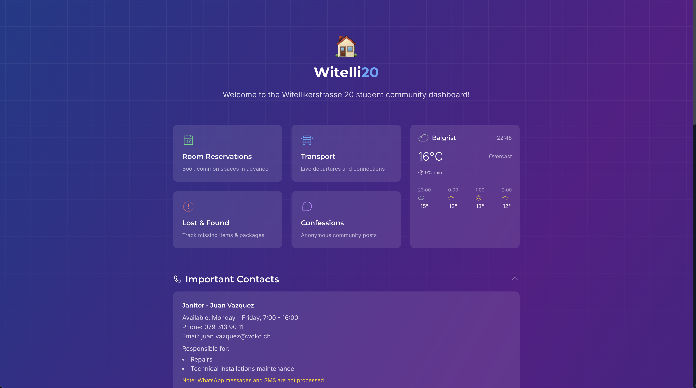

# Witelli20 Student Portal

[](https://opensource.org/licenses/MIT)
[](https://github.com/peaktwilight/witelli20)
[](https://github.com/peaktwilight/witelli20/stargazers)
[](https://github.com/peaktwilight/witelli20/releases)

A modern, responsive web application for student housing communities, featuring real-time transport information, room reservations, message boards, and more. Built with Next.js, Firebase, and Tailwind CSS.



## Features

- **Room Reservations**: Book common spaces like Foyer, Party Room or Rooftop Terrace
- **Transport Information**: Real-time transport schedules and departures
- **Lost & Found**: System for tracking missing items & packages
- **Message Board**: Interactive board for student communications
- **Weather**: Local weather forecast integration

## Getting Started

### Prerequisites

- Node.js 20.x or later
- npm or yarn
- Firebase account (for database functionality)

### Installation

1. Clone the repository
   ```bash
   git clone https://github.com/peaktwilight/witelli20.git
   cd witelli20
   ```

2. Install dependencies
   ```bash
   npm install
   # or
   yarn install
   ```

3. Set up environment variables
   - Copy `.env.example` to `.env.local`
   - Fill in your Firebase configuration details

4. Start the development server
   ```bash
   npm run dev
   # or
   yarn dev
   ```

5. Open [http://localhost:3000](http://localhost:3000) with your browser to see the result

## Environment Variables

Create a `.env.local` file in the root directory with the following variables:

```
NEXT_PUBLIC_FIREBASE_API_KEY=your_firebase_api_key
NEXT_PUBLIC_FIREBASE_AUTH_DOMAIN=your_project_id.firebaseapp.com
NEXT_PUBLIC_FIREBASE_PROJECT_ID=your_project_id
NEXT_PUBLIC_FIREBASE_STORAGE_BUCKET=your_project_id.appspot.com
NEXT_PUBLIC_FIREBASE_MESSAGING_SENDER_ID=your_messaging_sender_id
NEXT_PUBLIC_FIREBASE_APP_ID=your_app_id
```

## Contributing

This is an open source project, and contributions are welcome from anyone! Whether you want to fix bugs, add new features, improve documentation, or suggest ideas - your contributions are appreciated.

### How to Contribute

1. Fork the repository
2. Create your feature branch (`git checkout -b feature/YourFeature`)
3. Make your changes
4. Commit your changes (`git commit -m 'Add some feature'`)
5. Push to the branch (`git push origin feature/YourFeature`)
6. Open a Pull Request

## Project Structure

```
src/
├── app/                   # Next.js app router pages
│   ├── api/              # API routes
│   ├── board/            # Message board
│   ├── reservations/     # Room reservation system
│   ├── stolen/           # Lost & found tracking
│   ├── transport/        # Transport information
│   └── weather/          # Weather forecast
├── components/           # Reusable React components
├── lib/                  # Utility functions and APIs
│   ├── firebase.ts       # Firebase configuration
│   ├── transportApi.ts   # Transport API integration
│   └── weatherApi.ts     # Weather API integration
└── types/                # TypeScript type definitions
```

## Key Components

- `TransportBoard`: Displays transport information and schedules
- `StudentConnections`: Manages student transport connections 
- `ReservationCalendar`: Calendar view of room reservations
- `MessageActions`: Handles message-related actions
- `WeatherWidget`: Displays local weather information
- `QuickLinks`: Quick access to important resources
- `FAQ`: Frequently asked questions component

## Technologies Used

- [Next.js](https://nextjs.org/) - React framework
- [Firebase](https://firebase.google.com/) - Backend and hosting
- [Tailwind CSS](https://tailwindcss.com/) - Styling
- [TypeScript](https://www.typescriptlang.org/) - Type safety
- [Framer Motion](https://www.framer.com/motion/) - Animations
- [Phosphor Icons](https://phosphoricons.com/) - Icon system

## Learn More

To learn more about Next.js, take a look at the following resources:

- [Next.js Documentation](https://nextjs.org/docs) - learn about Next.js features and API.
- [Learn Next.js](https://nextjs.org/learn) - an interactive Next.js tutorial.

You can check out [the Next.js GitHub repository](https://github.com/vercel/next.js) - your feedback and contributions are welcome!

## Releases and Versioning

### Creating a New Release

The project includes automated tooling for managing releases:

1. Make your changes and commit them
2. Run the release script:
   ```bash
   npm run release
   ```
3. This will:
   - Update the version in package.json
   - Update the version in .env.local
   - Create a git tag
   - Push changes and tag to GitHub
   - Trigger the GitHub Actions workflow to create a release

### Manual Release Process

For more control over the release:

1. Update version:
   ```bash
   npm version patch  # or minor or major
   ```

2. Push with tags:
   ```bash
   git push --follow-tags
   ```

3. Or use GitHub CLI:
   ```bash
   gh release create v0.1.x --title "Release title" --notes "Release notes"
   ```

View all releases on the [GitHub Releases page](https://github.com/peaktwilight/witelli20/releases).

## Deployment

The project can be deployed on various platforms:

### Firebase Hosting

1. Install Firebase CLI:
   ```bash
   npm install -g firebase-tools
   ```

2. Login to Firebase:
   ```bash
   firebase login
   ```

3. Initialize Firebase (if not already done):
   ```bash
   firebase init
   ```
   - Select Hosting and Firestore options
   - Choose your Firebase project
   - Use `build` as the public directory

4. Build the project:
   ```bash
   npm run build
   ```

5. Deploy to Firebase:
   ```bash
   firebase deploy
   ```

### Vercel (Recommended)

This project can be easily deployed on [Vercel](https://vercel.com/):

1. Push your code to GitHub
2. Connect your repository to Vercel
3. Configure the environment variables
4. Vercel will automatically deploy when you push to main

## License

This project is licensed under the MIT License - see the [LICENSE](LICENSE) file for details.
